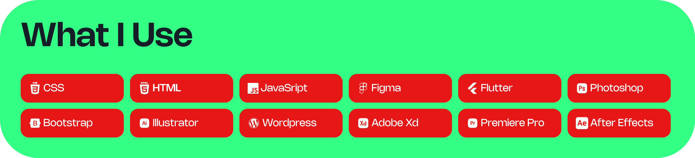

# Daniel Babalola 

</br>


## Introduction

Welcome to Dannny-Babs, the portfolio of Daniel Babalola. This repository showcases my skills and projects in web development, user interface (UI) design, user experience (UX) design, and mobile development.


## About Me

I am a computer science  undergrad, with a passion for creating intuitive and engaging user experiences. I have experience working on both front-end development and mobile app development projects.

## Contact Information

- LinkedIn: [LinkedIn Profile](https://www.linkedin.com/in/daniel-babalola)
- Portfolio: [Portfolio Website](https://dammydev.netlify.app)
- Instagram: [Instagram Profile](https://www.instagram.com/dammythedesigner)



## Technical Skills
| Skills                      |                            |                             |
|-----------------------------|----------------------------|-----------------------------|
| JavaScript                  | CSS                        | WordPress                   |
| Bootstrap                   | HTML5                      | User Interface (UI) Design |
| Web Development             | User Experience (UX) Design| Figma                       |
| Front-End Development       | Flutter                    | Mobile Development          |


<div style="display: flex; flex-direction: row;">
   
</div>

## My Stats

<!--START_SECTION:waka-->

```txt
Dart              2 hrs 20 mins   █████████████▓░░░░░░░░░░░   54.79 %
Groovy            33 mins         ███▒░░░░░░░░░░░░░░░░░░░░░   13.11 %
Java              32 mins         ███▒░░░░░░░░░░░░░░░░░░░░░   12.84 %
YAML              13 mins         █▒░░░░░░░░░░░░░░░░░░░░░░░   05.24 %
Batchfile         13 mins         █▒░░░░░░░░░░░░░░░░░░░░░░░   05.20 %
```

<!--END_SECTION:waka-->


